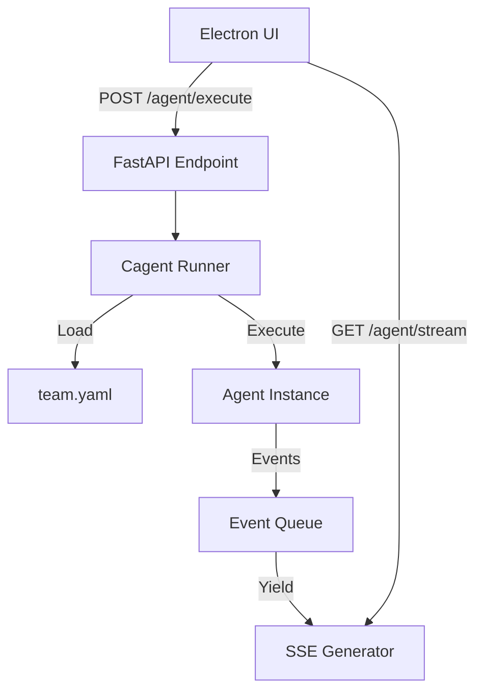

# PRP: Integrazione Runtime Cagent in Sidecar Python (Task 20)

## Goal
Integrare il motore di esecuzione `cagent` nel sidecar FastAPI esistente (`python/main.py`) per abilitare l'esecuzione reale degli agenti definiti in `team.yaml`. Sostituire i placeholder correnti con la logica effettiva di caricamento, esecuzione e streaming degli eventi.

## Why
- **Attivazione Agenti**: Attualmente il sidecar è uno scheletro. Questa task "accende" il cervello dell'applicazione.
- **Workflow Reale**: Senza il runtime, l'Orchestrator e gli altri agenti sono solo configurazioni YAML inerti.
- **Streaming**: L'interfaccia utente richiede feedback in tempo reale (pensiero, tool usage) che solo l'integrazione profonda con il sistema di eventi `cagent` può fornire.

## Architecture



## All Needed Context

### Documentation & References
- **Cagent Library**: `cagent` (presunta libreria interna/privata, basata su pattern ReAct/LangChain-like).
- **FastAPI SSE**: `sse-starlette` per lo streaming.
- **Python Asyncio**: Gestione code e task asincroni.

### Key Constraints & Gotchas
- **Event Loop**: `cagent` potrebbe essere sincrono o asincrono. Se sincrono, va eseguito in `run_in_executor` per non bloccare FastAPI.
- **State Management**: Il runtime deve mantenere lo stato della conversazione o ricaricarlo (stateless vs stateful). Per ora assumiamo esecuzione "one-shot" o session-based.
- **Hot Reload**: Il runner deve supportare il ricaricamento se `team.yaml` cambia (implementato in Task 5, qui va integrato).

## Implementation Blueprint

### 1. Dependency Update (`python/requirements.txt`)
Aggiungere `cagent` e dipendenze correlate.

### 2. Runtime Manager (`python/runtime.py`)
Creare una classe singleton `CagentRuntime` che:
- Carica `team.yaml` all'avvio.
- Inizializza gli agenti.
- Fornisce metodo `get_agent(name)`.
- Gestisce il reload della configurazione.

### 3. Event Adaptation
Adattare gli eventi di `cagent` (callback/hook) al formato SSE atteso dal frontend:
- `on_llm_start` -> `thinking`
- `on_tool_start` -> `tool_call`
- `on_tool_end` -> `tool_result`
- `on_agent_finish` -> `result`

### 4. FastAPI Integration (`python/main.py`)
Aggiornare gli endpoint:
- `POST /agent/execute`: Lancia l'esecuzione in background task e ritorna subito un `request_id`.
- `GET /agent/stream/{request_id}`: Si aggancia alla coda eventi di quella specifica esecuzione.

## Implementation Steps

1.  **Dependencies**: Aggiornare `requirements.txt`.
2.  **Runtime Logic**: Implementare `python/runtime.py` con caricamento `team.yaml`.
3.  **Event Bridge**: Creare un `CallbackHandler` custom per `cagent` che scrive su `asyncio.Queue`.
4.  **Main Integration**: Collegare il tutto in `python/main.py`.
5.  **Validation**: Testare con un agente "echo" o "orchestrator" base.

## Validation Gates

### 1. Import Test
```bash
python3 -c "import cagent; print('Cagent installed')"
```

### 2. Runtime Load Test
```bash
python3 -c "from python.runtime import CagentRuntime; r = CagentRuntime(); r.load('python/team.yaml'); print(r.list_agents())"
# Expected: ['orchestrator', 'extraction', ...]
```

### 3. Execution Test
```bash
# Avvia server
uvicorn python.main:app --port 8765 &
# Richiedi esecuzione
curl -X POST http://localhost:8765/agent/execute -d '{"agent_id": "orchestrator", "input": {"request": "test"}}'
```

## Quality Checklist
- [ ] Il server non si blocca durante l'esecuzione dell'agente (async check).
- [ ] Gli eventi SSE arrivano in ordine corretto.
- [ ] Errori nell'agente vengono propagati come eventi SSE di errore.
- [ ] Hot-reload di `team.yaml` aggiorna effettivamente gli agenti in memoria.
