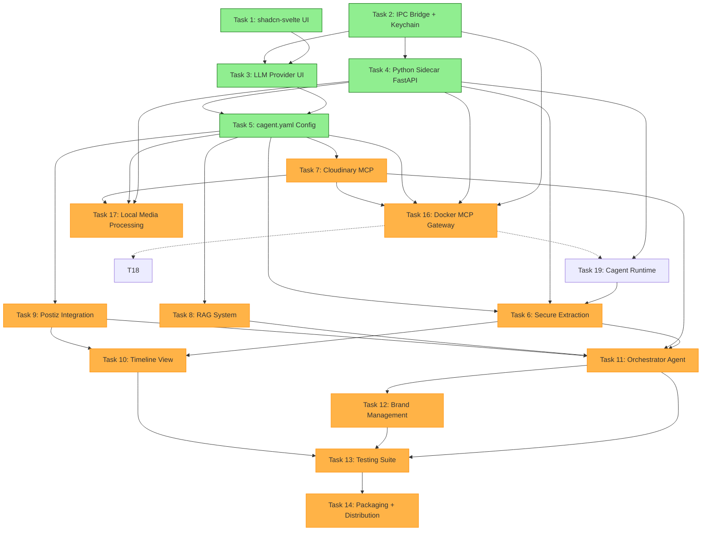

# Parallel Tasks Report - Trae Extractor App

**Generated:** 2026-02-05
**Version:** 3.0 (Task Unification Update)
**Total Tasks:** 19
**Status:** In Progress

---

## Executive Summary

Questo report identifica le **wave di esecuzione** aggiornate per lo sviluppo del progetto Trae Extractor. Il piano originale è stato ottimizzato unificando le attività di estrazione e sicurezza in un'unica **Task 6 (Super Task)**, eliminando la ridondanza della ex-Task 15.

### Metriche Chiave
- **Task Totali:** 19
- **Task Completate:** 5 (Task 1, 2, 3, 4, 5)
- **Task Pendenti:** 14
- **Focus Attuale:** **Wave 3** (Parallel Agents)
- **Collo di Bottiglia:** Task 6 (Extraction) sblocca gran parte delle funzionalità UI e di orchestrazione.

---

## Task Dependency Graph

---

## Parallel Execution Waves

### WAVE 0, 1, 2: Foundation & Core ✅ COMPLETED
**Status:** Task 1, 2, 3, 4, 5 completate.
L'infrastruttura base (Electron IPC, Python Sidecar, Cagent Config Generator) è pronta.

### WAVE 3: Agent Implementation (CURRENT FOCUS)
**Obiettivo:** Implementare le capacità verticali degli agenti.
**Parallelismo:** 4 Task possono procedere indipendentemente.

| Task | Titolo | Dipendenze | File Principali | Note |
|------|--------|------------|-----------------|------|
| **6** | **Secure Sandboxed Extraction** | 4, 19 | `python/sandboxed/`, `electron/osxphotos-supervisor.ts` | **CRITICAL PATH**. Include ora la logica di sicurezza (ex T15). |
| 7 | Cloudinary MCP | 5 | `python/agents/editing_agent.py`, `.mcp.json` | Indipendente. |
| 8 | RAG System | 5 | `python/rag/` | Indipendente. |
| 9 | Postiz Integration | 5 | `python/agents/scheduling_agent.py` | Indipendente. |
| 20 | Cagent Runtime | 4, 5 | `python/main.py` | Necessaria per far girare gli agenti reali. |

**Strategia Consigliata:**
1.  Completare **Task 19** (Cagent Runtime) per avere il motore di esecuzione.
2.  Completare **Task 6** (Secure Extraction) che è la più complessa e fondamentale per l'UX.
3.  Task 7, 8, 9 possono essere svolte in parallelo o successivamente.

### WAVE 4: Orchestration & UI Integration
**Prerequisiti:** Task 6, 7, 8, 9 completati.

| Task | Titolo | Dipendenze | Note |
|------|--------|------------|------|
| 11 | Orchestrator Agent | 6, 7, 8, 9 | Coordina gli agenti implementati nella Wave 3. |
| 10 | Timeline View | 6, 9 | UI principale per vedere i risultati. |

### WAVE 5: Advanced & Optimization
**Prerequisiti:** Task 4, 5, 7 completati.

| Task | Titolo | Dipendenze | Note |
|------|--------|------------|------|
| 16 | Docker MCP Gateway | 2, 4, 5, 7 | Gestione avanzata tool containerizzati. |
| 17 | Local Media Processing | 4, 5, 7 | Alternativa locale a Cloudinary. |

---

## File Orthogonality & Conflicts

| Area | Task Coinvolte | Rischio Conflitto | Mitigazione |
|------|----------------|-------------------|-------------|
| `python/sandboxed/` | **6** | Basso | Directory esclusiva per Task 6. |
| `python/agents/` | 6, 7, 8, 9, 11 | Basso | Ogni task ha il suo file agente specifico. |
| `electron/ipc-handlers.ts` | 6, 16 | Medio | Usare funzioni `register...Handlers` separate per ogni dominio. |
| `src/routes/` | 6, 7, 9, 10 | Basso | Ogni feature ha la sua route dedicata. |
| `python/main.py` | 4, 19, 6 | Medio | Task 6 e 19 toccano il main.py. Coordinare i merge. |

---

## Next Steps (Action Plan)

1.  **Immediato**: Iniziare **Task 6 (Secure Extraction)**.
    *   Implementare `python/sandboxed/` (infrastruttura di sicurezza).
    *   Implementare `electron/osxphotos-supervisor.ts`.
2.  **Parallelo**: Se possibile, avanzare su **Task 19 (Cagent Runtime)** per preparare il terreno all'integrazione degli agenti.

*Report updated by Architect mode - Trae Extractor App v3.0*
