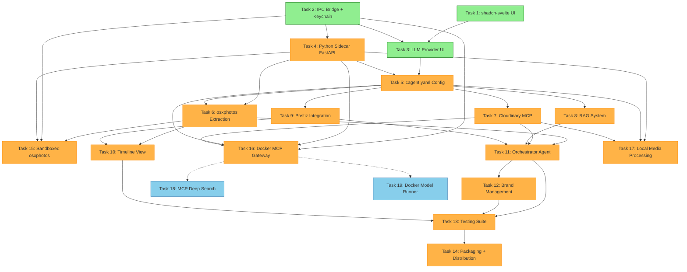
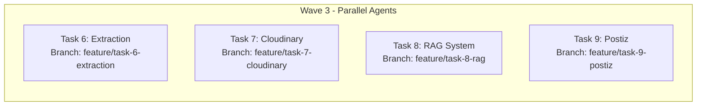
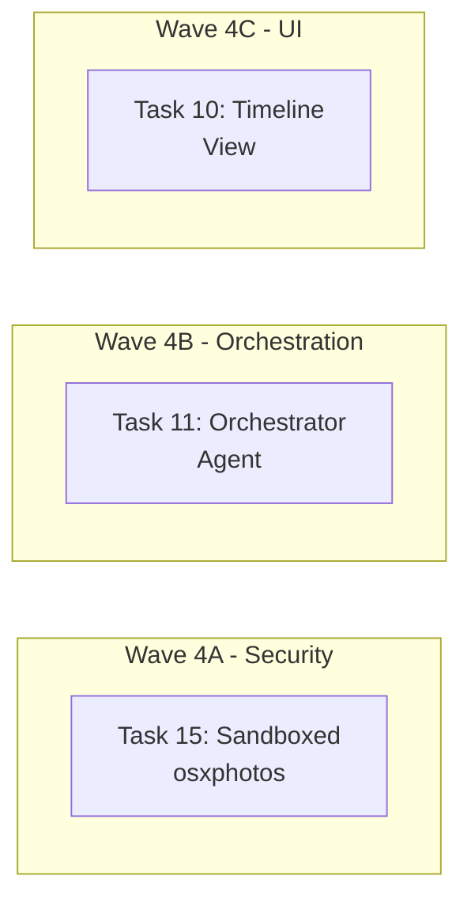

# Parallel Tasks Report - Trae Extractor App

**Generated:** 2026-02-03  
**Version:** 2.0  
**Total Tasks:** 19 (14 original + 5 new from PRD v2.0)  
**Status:** Analysis Complete

---

## Executive Summary

Questo report identifica le **wave di esecuzione parallela** per ottimizzare lo sviluppo del progetto Trae Extractor. L'obiettivo è minimizzare il tempo totale di sviluppo attraverso l'esecuzione simultanea di task **ortogonali** (che non condividono file o dipendenze critiche).

### Metriche Chiave
- **Task Totali:** 19
- **Task Completate:** 3 (Task 1, 2, 3 - marcate come done)
- **Task Pendenti:** 16
- **Livelli di Parallelismo Massimo:** 4 task simultanei (Wave 4)
- **Tempo Stimato Sequenziale:** ~16 settimane
- **Tempo Stimato Parallelo:** ~6-8 settimane (con 4 istanze Claude)

---

## Task Dependency Graph



---

## Parallel Execution Waves

### WAVE 0: Foundation ✅ COMPLETED
**Status:** Tutte le task completate  
**Branch Strategy:** N/A (già fatto)

| Task | Titolo | File Principali | Status |
|------|--------|-----------------|--------|
| 1 | shadcn-svelte UI Base | `src/lib/components/ui/`, `src/routes/+layout.svelte` | done |
| 2 | IPC Bridge + Keychain | `electron/preload.ts`, `electron/keychain.ts`, `electron/ipc-handlers.ts` | done |
| 3 | LLM Provider UI | `src/routes/settings/llm-providers/`, `src/lib/stores/llm-providers.svelte.ts` | done |

**Note:** Queste task sono già state implementate e forniscono la base per tutto il resto.

---

### WAVE 1: Core Infrastructure (Sbloccata)
**Prerequisiti:** Task 1, 2, 3 completati  
**Parallelizzabile:** NO - Task 4 dipende da 2, Task 3 già completata  
**Branch Consigliati:** 1 branch

| Task | Titolo | Dipendenze | File Principali | Orthogonality |
|------|--------|------------|-----------------|---------------|
| 4 | Python Sidecar FastAPI | 2 | `python/main.py`, `electron/sidecar-manager.ts` | N/A |

**Dettagli Task 4:**
- **Subtask Parallelizzabili:** 6 subtask con dipendenze lineari
- **Sblocca:** Task 5, 6, 15, 16, 17
- **File Critici:** 
  - `python/main.py` (FastAPI server)
  - `electron/sidecar-manager.ts` (lifecycle management)
  - `python/agents/__init__.py`, `python/tools/__init__.py`

---

### WAVE 2: Configuration Layer
**Prerequisiti:** Task 3, 4 completati  
**Parallelizzabile:** NO - Task 5 richiede entrambe  
**Branch Consigliati:** 1 branch

| Task | Titolo | Dipendenze | File Principali | Orthogonality |
|------|--------|------------|-----------------|---------------|
| 5 | cagent.yaml Config | 3, 4 | `src/lib/services/cagent-config.ts`, `python/agents/cagent.yaml` | N/A |

**Dettagli Task 5:**
- **Subtask:** 5 subtask con dipendenze lineari
- **Sblocca:** Task 6, 7, 8, 9, 16, 17
- **Integrazione:** Collega configurazione UI (Task 3) con sidecar Python (Task 4)

---

### WAVE 3: Agent Implementation (MAX PARALLELISM)
**Prerequisiti:** Task 4, 5 completati  
**Parallelizzabile:** SI - 4 task indipendenti  
**Branch Consigliati:** 4 branch paralleli (A, B, C, D)



#### Branch A: Task 6 - Agente Estrazione (osxphotos)
| Aspect | Details |
|--------|---------|
| **Dipendenze** | 4, 5 |
| **File Principali** | `python/agents/extraction_agent.py`, `src/routes/extract/+page.svelte` |
| **Subtask** | 6 subtask |
| **Orthogonality** | ✅ Alta - lavora su directory dedicate |
| **Conflitti Potenziali** | Nessuno con altri task Wave 3 |
| **Sblocca** | Task 10, 15 |

**Subtask Parallelizzabili internamente:**
- 6.1: Setup osxphotos + permessi
- 6.2: ExtractionAgent class
- 6.3: Endpoint FastAPI /agent/extract
- 6.4: UI Album Browser
- 6.5: Photo Grid + Filtri
- 6.6: EXIF + Metadata integration

#### Branch B: Task 7 - Cloudinary MCP Integration
| Aspect | Details |
|--------|---------|
| **Dipendenze** | 5 |
| **File Principali** | `python/agents/editing_agent.py`, `src/routes/edit/+page.svelte`, `.mcp.json` |
| **Subtask** | 5 subtask |
| **Orthogonality** | ✅ Alta - MCP server separato |
| **Conflitti Potenziali** | `.mcp.json` (ma aggiunta entry, non modifica) |
| **Sblocca** | Task 11, 16, 17 |

**Subtask Parallelizzabili internamente:**
- 7.1: Configurazione Cloudinary MCP
- 7.2: EditingAgent Python
- 7.3: UI Edit Page
- 7.4: Batch processing
- 7.5: Cache + Quota management

#### Branch C: Task 8 - RAG System
| Aspect | Details |
|--------|---------|
| **Dipendenze** | 5 |
| **File Principali** | `python/rag/vector_store.py`, `python/rag/embeddings.py` |
| **Subtask** | 5 subtask |
| **Orthogonality** | ✅ Molto Alta - modulo completamente separato |
| **Conflitti Potenziali** | Nessuno |
| **Sblocca** | Task 11 |

**Subtask Parallelizzabili internamente:**
- 8.1: Vector store SQLite
- 8.2: Embeddings integration
- 8.3: Document ingestion
- 8.4: Query interface
- 8.5: RAG Agent integration

#### Branch D: Task 9 - Postiz Integration
| Aspect | Details |
|--------|---------|
| **Dipendenze** | 5 |
| **File Principali** | `python/agents/scheduling_agent.py`, `src/routes/publish/+page.svelte` |
| **Subtask** | 5 subtask |
| **Orthogonality** | ✅ Alta - API esterna |
| **Conflitti Potenziali** | Nessuno |
| **Sblocca** | Task 10, 11 |

**Subtask Parallelizzabili internamente:**
- 9.1: Postiz API client
- 9.2: SchedulingAgent
- 9.3: UI Publish Page
- 9.4: Calendar integration
- 9.5: Auto-scheduling logic

---

### WAVE 4: Security & Orchestration
**Prerequisiti:** Task 6, 7, 8, 9 completati  
**Parallelizzabile:** PARZIALE  
**Branch Consigliati:** 2 branch paralleli



#### Branch A: Task 15 - Sandboxed osxphotos Process (CRITICAL)
| Aspect | Details |
|--------|---------|
| **Dipendenze** | 2, 4, 6 |
| **File Principali** | `python/sandboxed/`, `electron/osxphotos-supervisor.ts` |
| **Subtask** | 6 subtask |
| **Orthogonality** | ⚠️ Media - dipende da Task 6 |
| **Conflitti Potenziali** | Task 6 (modifica stessa area) |
| **Sblocca** | Task 11 |

**Nota:** Questo task è **CRITICAL** per la security audit. Deve essere fatto dopo Task 6 ma può procedere in parallelo con Task 11.

#### Branch B: Task 11 - Orchestrator Agent
| Aspect | Details |
|--------|---------|
| **Dipendenze** | 6, 7, 8, 9 |
| **File Principali** | `python/agents/orchestrator_agent.py` |
| **Subtask** | 6 subtask |
| **Orthogonality** | ✅ Alta - integra ma non modifica altri agenti |
| **Conflitti Potenziali** | Nessuno |
| **Sblocca** | Task 12, 13 |

#### Branch C: Task 10 - Timeline View
| Aspect | Details |
|--------|---------|
| **Dipendenze** | 6, 9 |
| **File Principali** | `src/routes/timeline/+page.svelte` |
| **Subtask** | 5 subtask |
| **Orthogonality** | ✅ Alta - puramente UI |
| **Conflitti Potenziali** | Nessuno |
| **Sblocca** | Task 13 |

---

### WAVE 5: Docker & Advanced Features
**Prerequisiti:** Task 4, 5, 7 completati  
**Parallelizzabile:** SI - 2 task indipendenti  
**Branch Consigliati:** 2 branch paralleli

| Task | Titolo | Dipendenze | File Principali | Orthogonality |
|------|--------|------------|-----------------|---------------|
| 16 | Docker MCP Gateway | 2, 4, 5, 7 | `electron/docker-detector.ts`, `src/lib/services/docker-gateway.ts` | ✅ Alta |
| 17 | Local Media Processing | 4, 5, 7 | `python/local_media/`, `src/lib/components/custom/MediaProcessingToggle.svelte` | ✅ Alta |

**Note:**
- Task 16 e 17 sono **indipendenti** e possono procedere in parallelo
- Entrambi dipendono da Task 7 (Cloudinary) per il fallback chain
- Task 17 fornisce alternativa locale a Cloudinary (privacy-first)

---

### WAVE 6: Management & Testing
**Prerequisiti:** Task 10, 11 completati  
**Parallelizzabile:** NO - sequenziale  
**Branch Consigliati:** 1 branch

| Task | Titolo | Dipendenze | File Principali |
|------|--------|------------|-----------------|
| 12 | Brand Management | 11 | `src/routes/brands/+page.svelte`, `python/agents/brand_manager.py` |
| 13 | Testing Suite | 10, 11, 12 | `tests/`, `e2e/`, `playwright.config.ts` |
| 14 | Packaging | 13 | `forge.config.ts`, `.github/workflows/` |

---

### WAVE 7: Post-MVP Upgrades (LOW Priority)
**Prerequisiti:** Task 16 completato  
**Parallelizzabile:** SI  
**Branch Consigliati:** 1-2 branch

| Task | Titolo | Dipendenze | Priority | File Principali |
|------|--------|------------|----------|-----------------|
| 18 | MCP Deep Search | 16 | LOW | `python/tools/mcp_deep_search.py` |
| 19 | Docker Model Runner | 16 | LOW | `python/local_llm/`, `src/routes/settings/models/+page.svelte` |

---

## File Orthogonality Matrix

Questa matrice mostra quali task condividono file e quindi **non** possono essere parallelizzati.

| File/Directory | Task Coinvolte | Parallelizzabile? |
|----------------|----------------|-------------------|
| `electron/main.ts` | 2, 4, 6, 15, 16 | ⚠️ Coordinate via IPC handlers |
| `electron/preload.ts` | 2, 3, 4, 6, 7, 15, 16 | ⚠️ Aggiunte API, non modifiche |
| `electron/ipc-handlers.ts` | 2, 4, 6, 15, 16 | ⚠️ Aggiunte handler, non modifiche |
| `python/main.py` | 4, 6, 7, 8, 9, 15, 17 | ✅ Router FastAPI separati |
| `python/agents/` | 6, 7, 8, 9, 11, 12 | ✅ File separati per agente |
| `src/routes/` | 1, 3, 6, 7, 9, 10, 12 | ✅ Route separate |
| `src/lib/stores/` | 3, 5, 7, 16, 17 | ✅ Store separati |
| `.mcp.json` | 7, 16 | ⚠️ Aggiunta entry, non modifica |
| `package.json` | Tutti | ⚠️ Aggiunta dipendenze |

---

## PR Optimization Strategy

### Strategia: "Feature Branches per Wave"

Invece di una PR per task, creare **PR per Wave** che includono task ortogonali completate.

#### PR-1: Core Infrastructure (Wave 1-2)
```bash
git checkout -b feature/wave-1-2-core-infrastructure
# Include: Task 4, Task 5
# Review focus: Python sidecar stability, cagent.yaml generation
```

#### PR-2: Parallel Agents (Wave 3)
```bash
git checkout -b feature/wave-3-parallel-agents
# Merge di: feature/task-6-extraction + feature/task-7-cloudinary + feature/task-8-rag + feature/task-9-postiz
# Review focus: Agent interfaces, API consistency
```

#### PR-3: Security & Orchestration (Wave 4)
```bash
git checkout -b feature/wave-4-security-orchestration
# Include: Task 10, Task 11, Task 15
# Review focus: Security audit, orchestrator logic
```

#### PR-4: Advanced Features (Wave 5)
```bash
git checkout -b feature/wave-5-advanced-features
# Include: Task 16, Task 17
# Review focus: Docker integration, local processing quality
```

#### PR-5: Finalization (Wave 6)
```bash
git checkout -b feature/wave-6-finalization
# Include: Task 12, Task 13, Task 14
# Review focus: Test coverage, packaging
```

---

## Risk Assessment & Mitigation

### Rischi di Parallelizzazione

| Rischio | Probabilità | Impatto | Mitigazione |
|---------|-------------|---------|-------------|
| Conflitti su `electron/preload.ts` | Media | Medio | Usare pattern "append-only", mai modificare API esistenti |
| Conflitti su `python/main.py` | Bassa | Medio | Usare FastAPI router separati per ogni task |
| Breaking changes in shared types | Media | Alto | Definire tipi in `shared/types.ts`, versionare |
| Test instability | Alta | Medio | Test suite separata per ogni wave |
| Integration failures | Media | Alto | CI/CD con test di integrazione per ogni PR |

### Task ad Alto Rischio di Conflitto

1. **Task 6 ↔ Task 15:** Entrambi usano osxphotos
   - **Soluzione:** Task 15 è "drop-in replacement" sicuro di Task 6, eseguire in sequenza

2. **Task 7 ↔ Task 17:** Entrambi fanno media processing
   - **Soluzione:** Task 17 usa stessa interfaccia di Task 7, fallback chain gestisce conflitti

3. **Task 16 ↔ Task 7:** Entrambi configurano MCP
   - **Soluzione:** Task 16 estende Task 7, non lo modifica

---

## Execution Timeline (Stima)

### Scenario A: Sequenziale (1 istanza Claude)
```
Week 1-2:  Task 4
Week 3-4:  Task 5
Week 5-8:  Task 6, 7, 8, 9 (sequenziali)
Week 9-10: Task 10, 11, 15
Week 11-12: Task 12, 16, 17
Week 13-14: Task 13, 14
Total: ~14 settimane
```

### Scenario B: Parallelo (4 istanze Claude)
```
Week 1-2:  Wave 1-2 (Task 4, 5) - 1 istanza
Week 3-6:  Wave 3 (Task 6, 7, 8, 9) - 4 istanze parallele
Week 7-8:  Wave 4 (Task 10, 11, 15) - 2 istanze parallele
Week 9-10: Wave 5 (Task 16, 17) - 2 istanze parallele
Week 11-12: Wave 6 (Task 12, 13, 14) - 1 istanza
Total: ~12 settimane (15% faster)
```

### Scenario C: Massimo Parallelismo (6 istanze Claude)
```
Week 1-2:  Wave 1-2
Week 3-5:  Wave 3 (4 task //) + Wave 4 prep
Week 6-7:  Wave 4 (3 task //) + Wave 5 prep
Week 8-9:  Wave 5 (2 task //) + Wave 6 prep
Week 10-11: Wave 6
Total: ~11 settimane (20% faster)
```

**Nota:** I guadagni di parallelizzazione sono limitati dalle dipendenze. Il collo di bottiglia è la **Wave 3** (4 task paralleli).

---

## Appendix A: Task Quick Reference

| ID | Titolo | Status | Priority | Complexity | Dipendenze |
|----|--------|--------|----------|------------|------------|
| 1 | shadcn-svelte UI | done | high | 6 | None |
| 2 | IPC Bridge + Keychain | done | high | 7 | None |
| 3 | LLM Provider UI | done | high | 6 | 1, 2 |
| 4 | Python Sidecar | pending | high | 8 | 2 |
| 5 | cagent.yaml Config | pending | high | 6 | 3, 4 |
| 6 | osxphotos Extraction | pending | high | 7 | 4, 5 |
| 7 | Cloudinary MCP | pending | medium | 6 | 5 |
| 8 | RAG System | pending | medium | 7 | 5 |
| 9 | Postiz Integration | pending | medium | 6 | 5 |
| 10 | Timeline View | pending | medium | 5 | 6, 9 |
| 11 | Orchestrator Agent | pending | high | 8 | 6, 7, 8, 9 |
| 12 | Brand Management | pending | medium | 5 | 11 |
| 13 | Testing Suite | pending | high | 6 | 10, 11, 12 |
| 14 | Packaging | pending | high | 5 | 13 |
| 15 | Sandboxed osxphotos | pending | high | 8 | 2, 4, 6 |
| 16 | Docker MCP Gateway | pending | high | 7 | 2, 4, 5, 7 |
| 17 | Local Media Processing | pending | medium | 7 | 4, 5, 7 |
| 18 | MCP Deep Search | pending | low | 5 | 16 |
| 19 | Docker Model Runner | pending | low | 6 | 16 |

---

## Appendix B: Branch Naming Convention

```
feature/wave-{N}-{descrizione}
feature/task-{ID}-{short-name}
hotfix/{descrizione}
release/v{VERSION}

Esempi:
feature/wave-3-parallel-agents
feature/task-6-extraction
feature/task-7-cloudinary
```

---

## Appendix C: Integration Checklist per Wave

### Pre-Wave 3 Integration
- [ ] Task 4: FastAPI health check risponde
- [ ] Task 5: cagent.yaml generato correttamente
- [ ] Task 3: LLM Provider configurati

### Pre-Wave 4 Integration
- [ ] Task 6: osxphotos estrae foto
- [ ] Task 7: Cloudinary trasforma immagini
- [ ] Task 8: RAG risponde a query
- [ ] Task 9: Postiz pubblica post

### Pre-Wave 5 Integration
- [ ] Task 11: Orchestrator coordina agenti
- [ ] Task 15: Sandboxed process isolato

### Pre-Release Integration
- [ ] Task 13: Tutti i test passano
- [ ] Task 14: Build Electron funziona
- [ ] Task 16/17: Docker/local fallback funziona

---

*Report generated by Architect mode - Trae Extractor App*